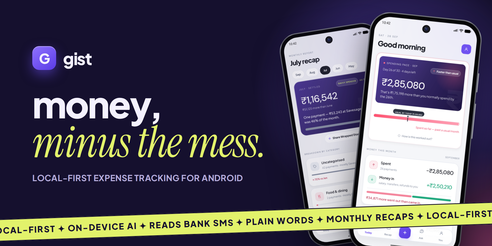
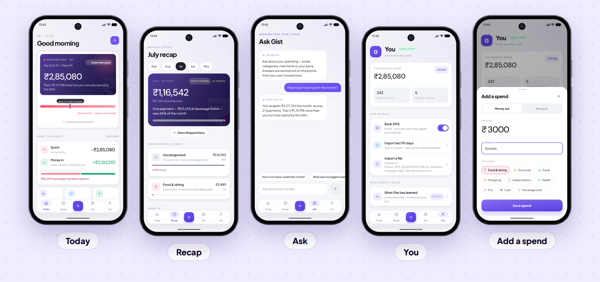

 

&nbsp;

  

  

**Your spending is split across UPI, cards, wallets and autopays.** 
Gist reads your bank SMS, logs every spend on its own, and tells you where your money went, in plain words.

 

 

## ✦ What's inside

<table>
<tr>
<td width="50%" valign="top">

### Today
**Know your pace, not just your total.** 
See what you've spent so far against your usual for this day of the month, and what's driving it. You find out you're running hot on the 26th, not after the month ends. One-off big spends are kept separate so they don't skew your pace.

</td>
<td width="50%" valign="top">

### Recap
**Every month, wrapped.** 
Your total, how it compares to last month, the one payment that ate most of it, and a category breakdown. Share it as a story.

</td>
</tr>
<tr>
<td width="50%" valign="top">

### Ask
**Just ask. Get it straight.** 
Type a question like you'd text a friend: *"How much have I spent this month?"* Gist works the answer out on your phone, from your own transactions.

</td>
<td width="50%" valign="top">

### You
**Reads bank SMS. Stays on your phone.** 
Turn on Bank SMS and new alerts are logged as they arrive. Import the last 90 days in one tap, or bring in bank statements as CSV or PDF. Add cash spends by hand.

</td>
</tr>
</table>

### Also in v1.0

- **Transfers aren't spending.** Money moved to investments or used to pay card bills is tracked separately, so it doesn't inflate your spend.
- **Subscriptions, found.** Gist spots your subscriptions, shows what each costs a year, and flags when a price goes up.
- **Money between people.** Keeps track of what moves between you and the people you pay.
- **Statement import.** Import bank statements from CSV or PDF.

 

## ✦ Install

> Gist isn't on the Play Store yet. You install it directly as an APK.

| | Step | What to do |
|:-:|---|---|
| **1** | **Download** | On your Android phone, tap [**Download APK**](https://github.com/SakshamSharma2026/gist-app/releases/download/v1.0.0/gist_v1.0.0.apk). |
| **2** | **Allow the install** | Android asks if your browser can install apps. Tap **Settings → Allow from this source**, go back, tap **Install**. If Play Protect shows a warning, tap **More details → Install anyway**. |
| **3** | **Allow restricted settings** | Android blocks SMS access for apps installed outside the Play Store. Open Gist and try turning on **Bank SMS** once. You'll see *"App was denied access"*. Tap **Close**, then go to **Settings → Apps → Gist → ⋮ (top right) → Allow restricted settings** and confirm with your fingerprint or PIN. |
| **4** | **Turn on Bank SMS** | Back in Gist, turn on **Bank SMS** and tap **Allow**, then tap **Import last 90 days**. Your Today screen fills up right away. |

**Updating:** download the latest APK from [Releases](https://github.com/SakshamSharma2026/gist-app/releases/latest) and install it over the old one. Your data stays.

 

## ✦ Privacy

- **No account.** No sign-up, no login.
- **Local-first and encrypted.** Your ledger is encrypted and stays on your phone.
- **On-device answers.** Ask works things out from the transactions stored on your phone.
- **Bank SMS only when you say so.** You turn on SMS logging in the **You** tab and can turn it off any time. Gist uses SMS access only to log your bank alerts.

 

## ✦ FAQ

<b>Why isn't Gist on the Play Store?</b>

 
Not yet. The APK here is the same app. If a Play Store version comes later, you can switch.

<b>Is the APK safe to install?</b>

 
Download it only from this repo's <a href="https://github.com/SakshamSharma2026/gist-app/releases/latest">Releases</a> page. Play Protect may warn you because the app isn't from the Play Store. That's expected for apps installed directly. Every version is signed with the same key, so updates install over the old version cleanly.

<b>It says "App was denied access" when I turn on SMS</b>

 
That's Android's <b>Restricted settings</b>. It applies to every app installed from an APK on Android 13 and later, not just Gist.
<ol>
<li>Tap <b>Close</b>.</li>
<li>Open <b>Settings → Apps → Gist</b> (or long-press the Gist icon → <b>App info</b>).</li>
<li>Tap <b>⋮</b> at the top right → <b>Allow restricted settings</b>, and confirm with your fingerprint or PIN.</li>
<li>Go to <b>Permissions → SMS → Allow</b>, or turn on Bank SMS again in Gist.</li>
</ol>
<b>Don't see ⋮?</b> It only appears after you've tried to turn on SMS once. Go back to Gist, try Bank SMS again, then reopen App info. 
<b>Still blocked?</b> If <i>Advanced Protection</i> is on (Android 16), Android won't allow it. Use <b>You → Import a file</b> instead.

<b>Which phones does it work on?</b>

 
Android phones. There's no iPhone version.

<b>Found a bug or have an idea?</b>

 
Open an <a href="https://github.com/SakshamSharma2026/gist-app/issues">issue</a>. Screenshots help.

 

Made in India &nbsp;✦&nbsp; <b>gist</b> — money, minus the mess.

